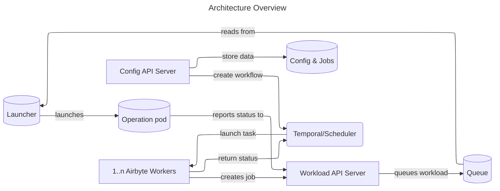

Airbyte is composed of two parts: **platform** and **connectors**.

The platform provides all the horizontal services required to configure and run data movement operations — the UI, configuration API, job scheduling, logging, alerting, and more. It is structured as a set of microservices.

Connectors are independent modules that push and pull data to and from sources and destinations. They are built in accordance with the [Airbyte Protocol](/platform/protocol) and packaged as Docker images, which allows total flexibility over the technologies used to implement them.

## Architecture diagram

## Components

<CardGroup cols={2}>
  <Card title="Config API Server" icon="server">
    `airbyte-server` — Airbyte's main controller and UI backend. All operations such as creating sources, destinations, and connections are configured and invoked through this API.
  </Card>
  <Card title="Database" icon="database">
    `airbyte-db` — Stores all configuration (credentials, frequency) and job history in PostgreSQL.
  </Card>
  <Card title="Temporal" icon="clock">
    `airbyte-temporal` — Manages scheduling and sequencing of task queues and workflows. Handles job orchestration at scale.
  </Card>
  <Card title="Workers" icon="cpu">
    `airbyte-worker` — Reads from task queues and executes connection scheduling and sequencing logic, making calls to the Workload API.
  </Card>
  <Card title="Workload API" icon="webhook">
    `airbyte-workload-api-server` — The HTTP interface for enqueuing workloads — the discrete pods that run connector operations.
  </Card>
  <Card title="Launcher" icon="rocket">
    `airbyte-workload-launcher` — Consumes events from the Workload API and interfaces with Kubernetes to launch workload pods.
  </Card>
</CardGroup>

## Supporting components

The diagram shows steady-state operation. Additional components you will see in your deployment:

- **Cron** (`airbyte-cron`): Cleans server and sync logs when using local logs. Regularly updates connector definitions and sweeps old workloads, ensuring eventual consensus.
- **Bootloader** (`airbyte-bootloader`): Upgrades and migrates database tables on startup, and confirms that the environment is ready to operate.

## How a sync works

<Steps>
  <Step title="Connection configured">
    A user creates a connection via the Config API Server. The configuration is persisted to the database and a workflow is registered in Temporal.
  </Step>
  <Step title="Scheduler fires">
    At the scheduled time (or on manual trigger), Temporal places a task on the queue. A Worker picks up the task.
  </Step>
  <Step title="Workload created">
    The Worker calls the Workload API to create a workload entry. The Workload API enqueues the workload.
  </Step>
  <Step title="Pod launched">
    The Launcher reads the queued workload and instructs Kubernetes to launch an operation pod. The connector images run inside this pod.
  </Step>
  <Step title="Status reported">
    The operation pod reports its status back to the Workload API. Temporal is notified, and the Worker updates the job record in the database.
  </Step>
</Steps>

## Kubernetes deployment

For Airbyte deployed on Kubernetes the structure is very similar. The control-plane components (`server`, `temporal`, `worker`, `workload-api-server`, `workload-launcher`) run as Kubernetes `Deployment` objects. Connector workloads run as ephemeral pods launched by the Launcher and cleaned up after completion.

<Note>
  The `workload-launcher` is responsible for managing all connector-related pods: `check`, `discover`, `read`, `write`, and `orchestrator`.
</Note>
